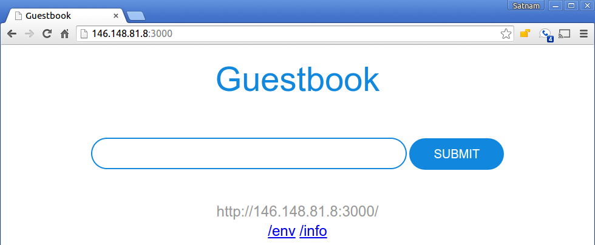

## Guestbook Example

This example shows how to build a simple multi-tier web application using Kubernetes and Docker. The application consists of a web front end, Redis master for storage, and replicated set of Redis slaves, all for which we will create Kubernetes replication controllers, pods, and services.

##### Table of Contents

 * [Prerequisites](#prerequisites)
 * [Create the Redis master pod](#create-the-redis-master-pod)
 * [Create the Redis master service](#create-the-redis-master-service)
 * [Create the Redis slave pods](#create-the-redis-slave-pods)
 * [Create the Redis slave service](#create-the-redis-slave-service)
 * [Create the guestbook pods](#create-the-guestbook-pods)
 * [Create the guestbook service](#create-the-guestbook-service)
 * [View the guestbook](#view-the-guestbook)
 * [Cleanup](#cleanup)

### Prerequisites

This example assumes that you have a working cluster. See the [Getting Started Guides](https://kubernetes.io/docs/setup/) for details about creating a cluster.

**Tip:** View all the `kubectl` commands, including their options and descriptions in the [kubectl CLI reference](https://kubernetes.io/docs/user-guide/kubectl-overview/).

All of the commands specified should be run from this directory.

### Create the Redis master pod

Use the `redis-master-deployment.yaml` file to create a [replication controller](https://kubernetes.io/docs/concepts/workloads/controllers/replicationcontroller/) and Redis master [pod](https://kubernetes.io/docs/concepts/workloads/pods/pod-overview/). The pod runs a Redis key-value server in a container. Using a replication controller is the preferred way to launch long-running pods, even for 1 replica, so that the pod benefits from the self-healing mechanism in Kubernetes (keeps the pods alive).

1. Use the [redis-master-deployment.yaml](redis-master-deployment.yaml) file to create the Redis master deployment in your Kubernetes cluster by running the `kubectl create -f` *`filename`* command:

    ```console
    $ kubectl create -f redis-master-deployment.yaml
    deployment "redis-master" created
    ```

2. To verify that the redis-master controller is up, list the deployment and replicaset you created in the cluster with the `kubectl get` command (if you don't specify a `--namespace`, the `default` namespace will be used. The same below):

    ```console
    $ kubectl get deploy
    NAME           DESIRED   CURRENT   UP-TO-DATE   AVAILABLE   AGE
    redis-master   1         1         1            1           10m

    $ kubectl get replicaset
    NAME                      DESIRED   CURRENT   READY     AGE
    redis-master-6767cf65c7   1         1         1         11m
    ```

    Result: The deployment creates the replicaset, which then creates the single Redis master pod.

3. To verify that the redis-master pod is running, list the pods you created in cluster with the `kubectl get pods` command:

    ```console
    $ kubectl get pods
    NAME                        READY     STATUS    RESTARTS   AGE
    redis-master-xx4uv          1/1       Running   0          1m
    ...
    ```

    Result: You'll see a single Redis master pod and the machine where the pod is running after the pod gets placed (may take up to thirty seconds).

### Create the Redis master service

A Kubernetes [service](https://kubernetes.io/docs/concepts/services-networking/service/) is a named load balancer that proxies traffic to one or more pods. The services in a Kubernetes cluster are discoverable inside other pods via environment variables or DNS.

Services find the pods to load balance based on pod labels. The pod that you created in previous step has the label `app=redis` and `role=master`. The selector field of the service determines which pods will receive the traffic sent to the service.

1. Use the [redis-master-service.yaml](redis-master-service.yaml) file to create the service in your Kubernetes cluster by running the `kubectl create -f` *`filename`* command:

    ```console
    $ kubectl create -f redis-master-service.yaml
    services/redis-master
    ```

2. To verify that the redis-master service is up, list the services you created in the cluster with the `kubectl get services` command:

    ```console
    $ kubectl get services
    NAME              CLUSTER_IP       EXTERNAL_IP       PORT(S)       SELECTOR               AGE
    redis-master      10.0.136.3       <none>            6379/TCP      app=redis,role=master  1h
    ...
    ```

    Result: All new pods will see the `redis-master` service running on the host (`$REDIS_MASTER_SERVICE_HOST` environment variable) at port `6379`, or running on `redis-master:6379`. After the service is created, the service proxy on each node is configured to set up a proxy on the specified port (in our example, that's port `6379`).


### Create the Redis slave pods

The Redis master we created earlier is a single pod (REPLICAS = 1), while the Redis read slaves we are creating here are 'replicated' pods. In Kubernetes, a replication controller is responsible for managing the multiple instances of a replicated pod.

1. Use the file [redis-slave-deployment.yaml](redis-slave-deployment.yaml) to create the replication controller by running the `kubectl create -f` *`filename`* command:

    ```console
    $ kubectl create -f redis-slave-deployment.yaml
    deployment.apps "redis-slave" created
    ```

2. To verify that the redis-slave controller is running, run the `kubectl get rc` command:

    ```console
    $ kubectl get deploy
    NAME           DESIRED   CURRENT   UP-TO-DATE   AVAILABLE   AGE
    redis-master   1         1         1            1           23m
    redis-slave    2         2         2            0           15s

    $ kubectl get rs
    NAME                      DESIRED   CURRENT   READY     AGE
    redis-master-6767cf65c7   1         1         1         23m
    redis-slave-564b7bd5d9    2         2         2         30s

    ```

    Result: The deployment creates the replicaset, which then creates configures the Redis slave pods through the redis-master service (name:port pair, in our example that's `redis-master:6767cf65c7`).

    Example:
    The Redis slaves get started by the deployment/replicaset with the following command:

    ```console
    redis-server --slaveof redis-master 6379
    ```

3. To verify that the Redis master and slaves pods are running, run the `kubectl get pods` command:

    ```console
    $ kubectl get pods
    NAME                          READY     STATUS    RESTARTS   AGE
    redis-master-xx4uv            1/1       Running   0          25m
    redis-slave-b6wj4             1/1       Running   0          1m
    redis-slave-iai40             1/1       Running   0          1m
    ...
    ```

    Result: You see the single Redis master and two Redis slave pods.

### Create the Redis slave service

Just like the master, we want to have a service to proxy connections to the read slaves. In this case, in addition to discovery, the Redis slave service provides transparent load balancing to clients.

1. Use the [redis-slave-service.yaml](redis-slave-service.yaml) file to create the Redis slave service by running the `kubectl create -f` *`filename`* command:

    ```console
    $ kubectl create -f redis-slave-service.yaml
    service "redis-slave" created
    ```

2. To verify that the redis-slave service is up, list the services you created in the cluster with the `kubectl get services` command:

    ```console
    $ kubectl get services
    NAME              CLUSTER_IP       EXTERNAL_IP       PORT(S)       SELECTOR               AGE
    redis-master      10.0.136.3       <none>            6379/TCP      app=redis,role=master  1h
    redis-slave       10.0.21.92       <none>            6379/TCP      app-redis,role=slave   1h
    ...
    ```

    Result: The service is created with labels `app=redis` and `role=slave` to identify that the pods are running the Redis slaves.

Tip: It is helpful to set labels on your services themselves--as we've done here--to make it easy to locate them later.

### Create the guestbook pods

This is a simple Go `net/http` ([negroni](https://github.com/codegangsta/negroni) based) server that is configured to talk to either the slave or master services depending on whether the request is a read or a write. The pods we are creating expose a simple JSON interface and serves a jQuery-Ajax based UI. Like the Redis read slaves, these pods are also managed by a replication controller.

1. Use the [guestbook-deployment.yaml](guestbook-deployment.yaml) file to create the guestbook replication controller by running the `kubectl create -f` *`filename`* command:

    ```console
    $ kubectl create -f guestbook-deployment.yaml
    deployment.apps "guestbook" created
    ```

 Tip: If you want to modify the guestbook code it can be found in the `guestbook` directory, along with its Makefile. If you have pushed your custom image be sure to update the `image` property accordingly in the guestbook-deployment.yaml.

2. To verify that the guestbook deployment is running, run the `kubectl get deploy` command:

    ```console
    $ kubectl get deploy
    NAME           DESIRED   CURRENT   UP-TO-DATE   AVAILABLE   AGE
    guestbook      3         3         3            3           38s
    redis-master   1         1         1            1           27m
    redis-slave    2         2         2            2           4m
    ```

3. To verify that the guestbook pods are running (it might take up to thirty seconds to create the pods), list the pods you created in cluster with the `kubectl get pods` command:

    ```console
    $ kubectl get pods
    NAME                           READY     STATUS    RESTARTS   AGE
    guestbook-3crgn                1/1       Running   0          2m
    guestbook-gv7i6                1/1       Running   0          2m
    guestbook-x405a                1/1       Running   0          2m
    redis-master-xx4uv             1/1       Running   0          23m
    redis-slave-b6wj4              1/1       Running   0          6m
    redis-slave-iai40              1/1       Running   0          6m
    ...
    ```

    Result: You see a single Redis master, two Redis slaves, and three guestbook pods.

### Create the guestbook service

Just like the others, we create a service to group the guestbook pods but this time, to make the guestbook front end externally visible, we specify `"type": "LoadBalancer"`.

1. Use the [guestbook-service.yaml](guestbook-service.yaml) file to create the guestbook service by running the `kubectl create -f` *`filename`* command:

    ```console
    $ kubectl create -f guestbook-service.yaml
    ```

2. To verify that the guestbook service is up, list the services you created in the cluster with the `kubectl get services` command:

    ```console
    $ kubectl get services
    NAME              CLUSTER_IP       EXTERNAL_IP       PORT(S)       SELECTOR               AGE
    guestbook         10.0.217.218     146.148.81.8      3000/TCP      app=guestbook          1h
    redis-master      10.0.136.3       <none>            6379/TCP      app=redis,role=master  1h
    redis-slave       10.0.21.92       <none>            6379/TCP      app-redis,role=slave   1h
    ...
    ```

    Result: The service is created with label `app=guestbook`.

### View the guestbook

You can now play with the guestbook that you just created by opening it in a browser (it might take a few moments for the guestbook to come up).

 * **Local Host:**
    If you are running Kubernetes locally, to view the guestbook, navigate to `http://localhost:3000` in your browser.

 * **Remote Host:**
    1. To view the guestbook on a remote host, locate the external IP of the load balancer in the **IP** column of the `kubectl get services` output. In our example, the internal IP address is `10.0.217.218` and the external IP address is `146.148.81.8` (*Note: you might need to scroll to see the IP column*).

    2. Append port `3000` to the IP address (for example `http://146.148.81.8:3000`), and then navigate to that address in your browser.

    Result: The guestbook displays in your browser:

    


### Cleanup

After you're done playing with the guestbook, you can cleanup by deleting the guestbook service and removing the associated resources that were created, including load balancers, forwarding rules, target pools, and Kubernetes replication controllers and services.

Delete all the resources by running the following `kubectl delete -f .` command:

```console
$ kubectl delete -f .
replicationcontroller "guestbook" deleted
service "guestbook" deleted
replicationcontroller "redis-master" deleted
service "redis-master" deleted
replicationcontroller "redis-slave" deleted
service "redis-slave" deleted
```

Tip: To tear down your Kubernetes cluster, follow the corresponding instructions in the version of the [Getting Started Guides](https://kubernetes.io/docs/getting-started-guides/) that you previously used to create your cluster.
